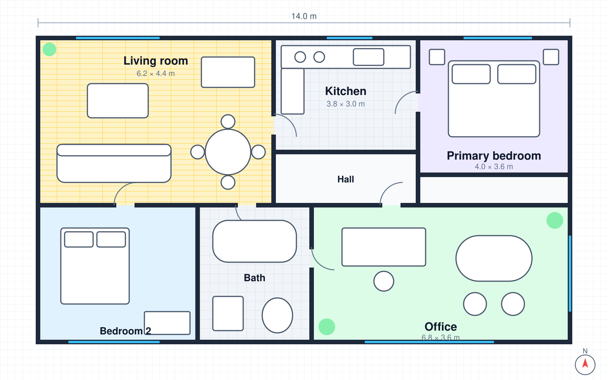

# Orion Media Kit

A **zero-dependency** set of media components for admin dashboards: carousels, galleries,
players and document previews. Everything ships in *one* `<script>` tag.

> Tip: every component works in plain HTML, React, Vue and Angular.

## Features

- Carousel with swipe, autoplay and thumbnails
- Gallery with a pinch-zoom **lightbox**
  - Masonry, grid and justified layouts
  - Keyboard: `←` `→` `+` `-` `0`
- Players with captions and a ~~flash~~ waveform
- [x] Markdown preview
- [ ] Spreadsheet preview (planned)

## Install

```html
<script src="orion.js"></script>
<o-carousel autoplay="5000" loop dots>…</o-carousel>
```

```js
const blob = await Orion.image.compress(file, { maxWidth: 1600, quality: 0.8 });
console.log(blob.report.saved); // e.g. "72%"
```

## Formats

| Type     | Renderer               | Zoom |
|----------|------------------------|:----:|
| PDF      | Browser viewer         |  ✓   |
| DOCX     | Built-in converter     |  ✓   |
| CSV      | Table                  |  ✓   |
| Markdown | Safe mini renderer     |  ✓   |

1. Drop a file on the upload zone
2. Click **Preview**
3. Done — see the [project site](https://example.com/orion "Orion Admin").



---

Made with care · <script>alert('never executed')</script>
